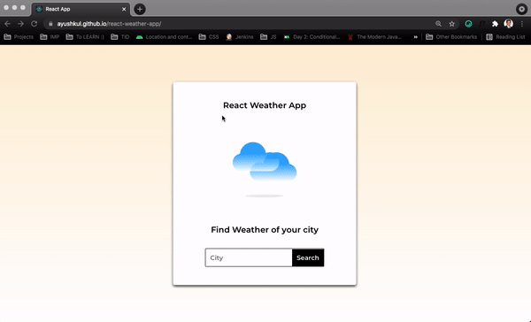

# 🌤️ Weather Application

A responsive web app that fetches and displays real-time weather data for any city worldwide using the **OpenWeatherMap API** — built with React.js.

🔗 **[Live Demo](https://ayushkul.github.io/react-weather-app)**



---

## 📌 About the Project

This project is a clean, responsive weather application that lets users search for any city and instantly view current weather conditions — temperature, humidity, wind speed, and more. It integrates with the OpenWeatherMap public API to deliver live data in a visually appealing interface.

---

## ✨ Features

- 🔍 **City search** — Look up current weather for any city globally
- 🌡️ **Live weather data** — Real-time temperature, humidity, wind speed & conditions
- 🌥️ **Weather icons** — Dynamic icons that reflect current weather conditions
- 📱 **Fully responsive** — Optimized for desktop, tablet, and mobile screens
- ⚡ **Fast API calls** — Powered by Axios for efficient HTTP requests
- 💅 **Styled Components** — Scoped, maintainable CSS-in-JS styling

---

## 🛠️ Tech Stack

| Category | Technology |
|----------|-----------|
| Frontend | React.js |
| API | OpenWeatherMap API |
| HTTP Client | Axios |
| Styling | Styled Components |
| Font | Google Fonts — Montserrat |
| Deployment | GitHub Pages |

---

## 📁 Project Structure

```
react-weather-app/
├── public/
│   ├── icons/              # Weather condition icons
│   └── index.html
├── src/
│   ├── components/
│   │   ├── SearchBar.jsx
│   │   ├── WeatherCard.jsx
│   │   ├── WeatherDetails.jsx
│   │   └── Loader.jsx
│   ├── App.js
│   ├── App.css
│   └── index.js
├── .env
├── .gitignore
└── package.json
```

---

## 🌐 API Integration

This app uses the **OpenWeatherMap Current Weather API**.

| Detail | Info |
|--------|------|
| Method | `GET` |
| Base URL | `https://api.openweathermap.org/data/2.5/weather` |
| Params | `q={CITY_NAME}&appid={API_KEY}&units=metric` |
| Docs | [openweathermap.org/current](https://openweathermap.org/current) |

**Sample Response Fields Used:**

```json
{
  "name": "Ahmedabad",
  "main": {
    "temp": 32.5,
    "humidity": 60,
    "feels_like": 35.1
  },
  "weather": [{ "description": "clear sky", "icon": "01d" }],
  "wind": { "speed": 4.2 }
}
```

---

## 🚀 Getting Started

### Prerequisites

- [Node.js](https://nodejs.org/) v14+
- A free API key from [OpenWeatherMap](https://openweathermap.org/api)

### Installation

1. **Clone the repository**

```bash
git clone https://github.com/your-username/react-weather-app.git
cd react-weather-app
```

2. **Install dependencies**

```bash
npm install
```

3. **Set up environment variables**

Create a `.env` file in the root directory:

```env
REACT_APP_WEATHER_API_KEY=your_openweathermap_api_key
```

> 🔑 Get your free API key at [openweathermap.org/api](https://openweathermap.org/api)

4. **Start the development server**

```bash
npm start
```

App runs at `http://localhost:3000`

---

## 📦 Available Scripts

| Command | Description |
|---------|-------------|
| `npm start` | Run the app in development mode |
| `npm run build` | Build the app for production |
| `npm test` | Launch the test runner |
| `npm run deploy` | Deploy to GitHub Pages |

---

## 🚢 Deployment

This app is deployed via **GitHub Pages**. To deploy your own:

1. Install the gh-pages package:
```bash
npm install gh-pages --save-dev
```

2. Add to `package.json`:
```json
"homepage": "https://your-username.github.io/react-weather-app",
"scripts": {
  "predeploy": "npm run build",
  "deploy": "gh-pages -d build"
}
```

3. Deploy:
```bash
npm run deploy
```

---

## 📸 Screenshots

| Search View | Weather Result | Mobile View |
|-------------|----------------|-------------|
|  |  |  |

> _Replace placeholders with actual screenshots_

---

## 🤝 Contributing

1. Fork the repository
2. Create your branch: `git checkout -b feature/your-feature`
3. Commit your changes: `git commit -m "Add your feature"`
4. Push to the branch: `git push origin feature/your-feature`
5. Open a Pull Request

---

## 📄 License

This project is licensed under the [MIT License](LICENSE).

---

## 👤 Author

**Hardik Patel**  
[](https://github.com/Hardik-1874)

---

> ⭐ Found this useful? Give it a star and share it!
